# figmad-mcp Documentation

## How It Works

figmad-mcp is an MCP (Model Context Protocol) server that enables AI agents to interact with Figma. It runs as a **stdio-based server** that your AI client (Claude Desktop, Cursor, etc.) spawns and communicates with.

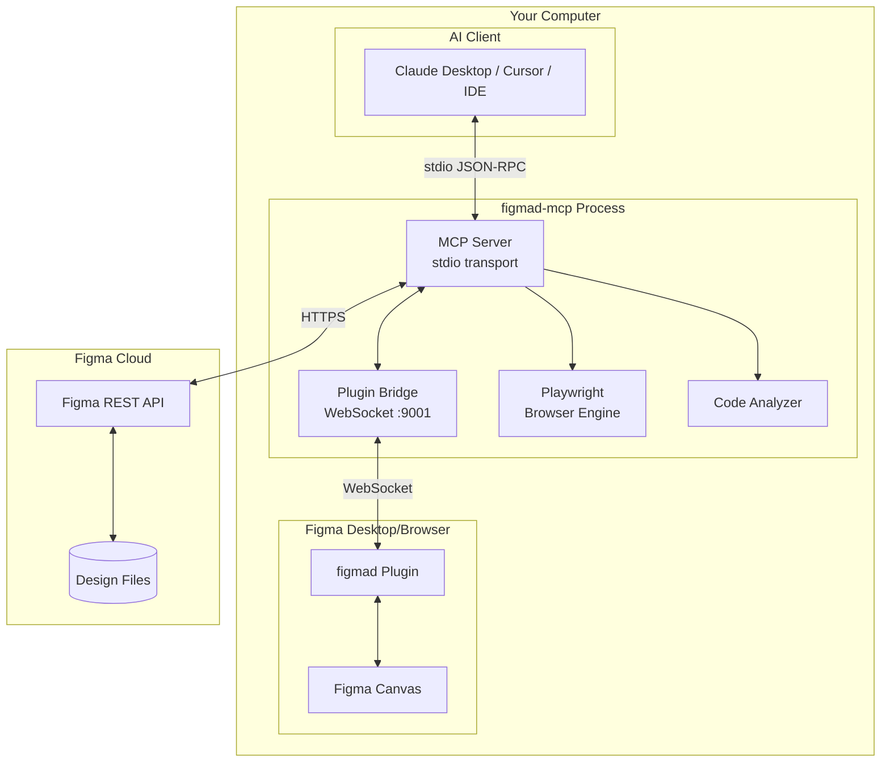

## MCP Communication Flow

The MCP protocol uses JSON-RPC over stdio. When you ask Claude to interact with Figma:

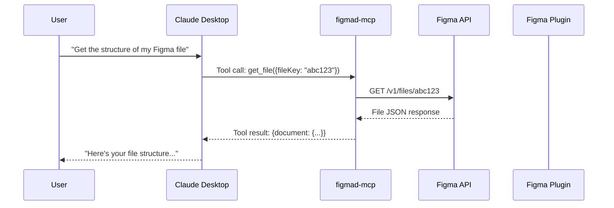

## Setup & Running

### Step 1: Configure Your AI Client

Add figmad-mcp to your MCP client configuration:

**Claude Desktop** (`~/.config/claude/claude_desktop_config.json`):
```json
{
  "mcpServers": {
    "figmad": {
      "command": "node",
      "args": ["/absolute/path/to/figmad-mcp/dist/index.js"],
      "env": {
        "FIGMA_ACCESS_TOKEN": "figd_xxxxxxxxxxxxx"
      }
    }
  }
}
```

**Cursor** (`.cursor/mcp.json` in your project):
```json
{
  "mcpServers": {
    "figmad": {
      "command": "node",
      "args": ["/absolute/path/to/figmad-mcp/dist/index.js"],
      "env": {
        "FIGMA_ACCESS_TOKEN": "figd_xxxxxxxxxxxxx"
      }
    }
  }
}
```

### Step 2: Start Your AI Client

When you start Claude Desktop or Cursor, it automatically spawns the figmad-mcp process.

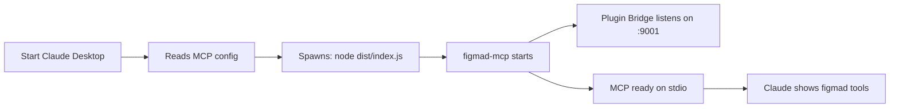

### Step 3: Connect Figma Plugin (for write operations)

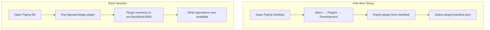

## Tool Categories

### Read Operations (Always Available)

These use the Figma REST API directly - no plugin needed:

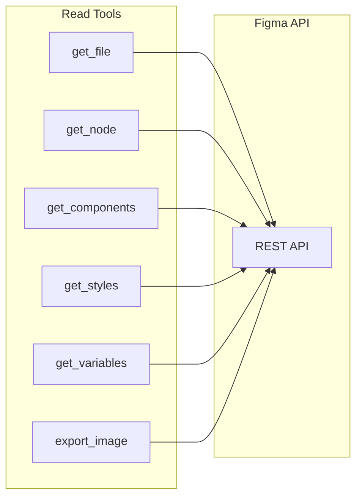

### Write Operations (Plugin Required)

These require the Figma plugin to be running:

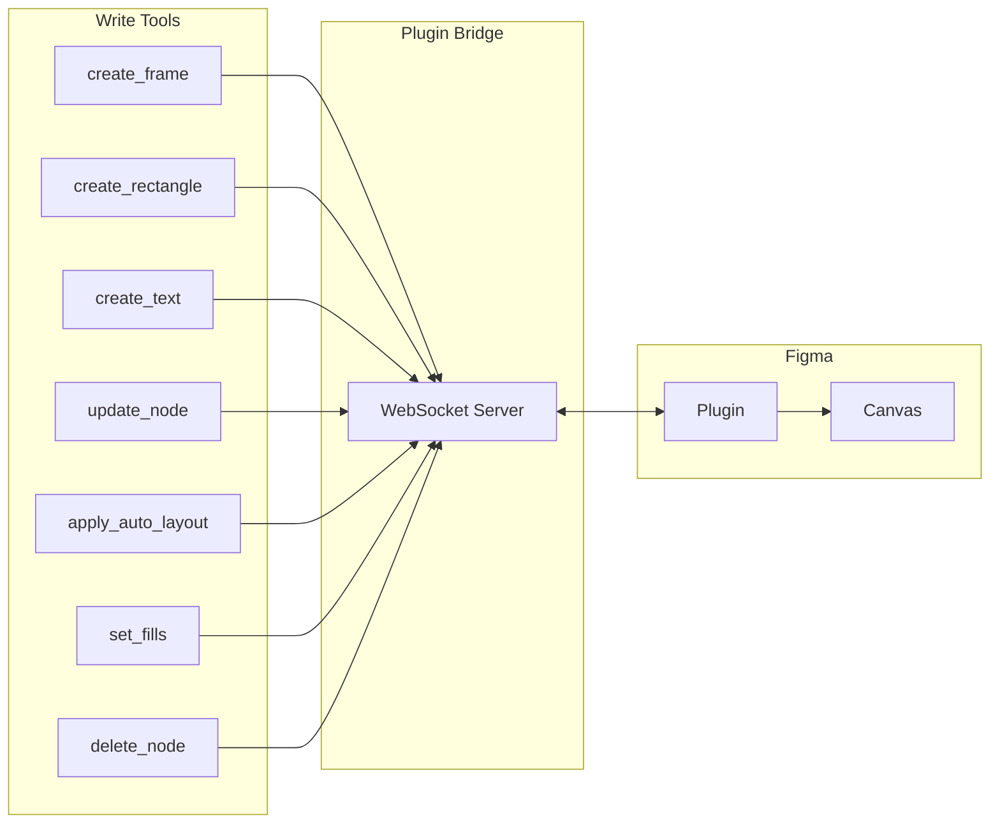

### Orchestrated Tools (Complex Workflows)

These combine multiple operations:

```mermaid
flowchart TB
    subgraph "generate_ui"
        GU[Parse prompt] --> GU2[Create layout structure]
        GU2 --> GU3[Create frames/shapes/text]
        GU3 --> GU4[Apply styles]
    end
    
    subgraph "capture_webpage"
        CW[Launch Playwright] --> CW2[Navigate to URL]
        CW2 --> CW3[Screenshot + DOM extraction]
        CW3 --> CW4[Detect UI components]
        CW4 --> CW5[Store capture]
    end
    
    subgraph "reconstruct_page"
        RP[Load capture] --> RP2[Create root frame]
        RP2 --> RP3[Recreate DOM as Figma nodes]
        RP3 --> RP4[Apply computed styles]
    end
    
    subgraph "analyze_codebase"
        AC[Scan directory] --> AC2[Parse components]
        AC2 --> AC3[Extract props/variants]
        AC3 --> AC4[Find Tailwind/CSS tokens]
    end
    
    subgraph "sync_design_tokens"
        ST[Load Figma variables] --> ST2[Load code tokens]
        ST2 --> ST3[Compare/generate output]
    end
```

## Workflow Examples

### Workflow 1: Generate UI from Prompt

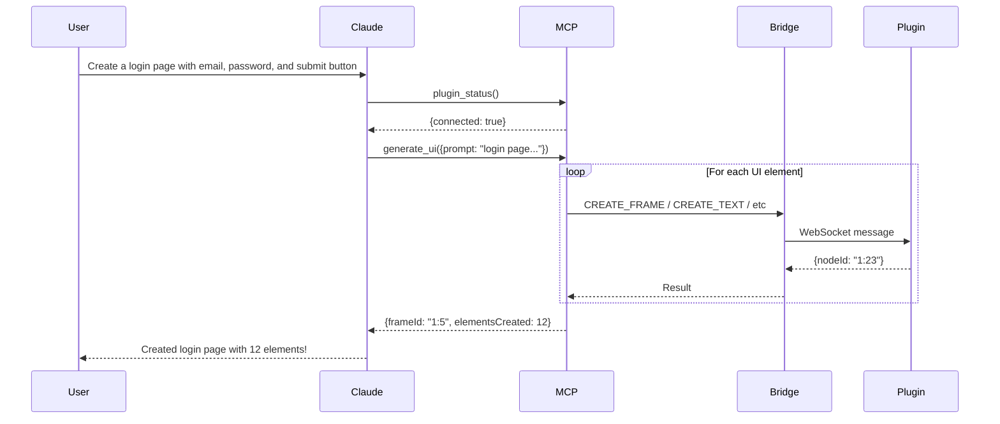

### Workflow 2: Capture Website → Figma

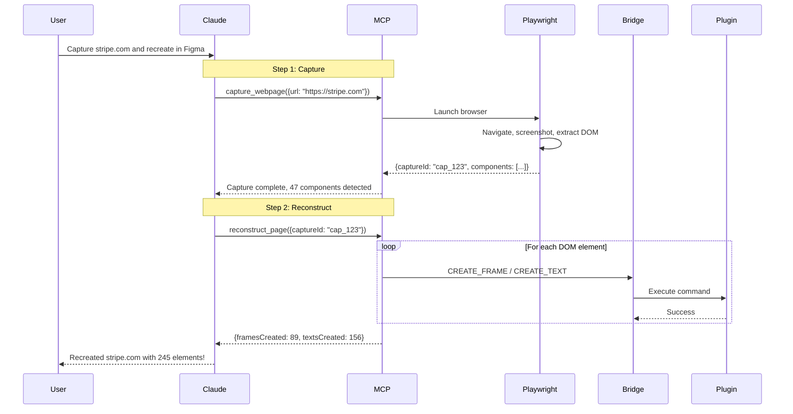

### Workflow 3: Code → Figma Token Sync

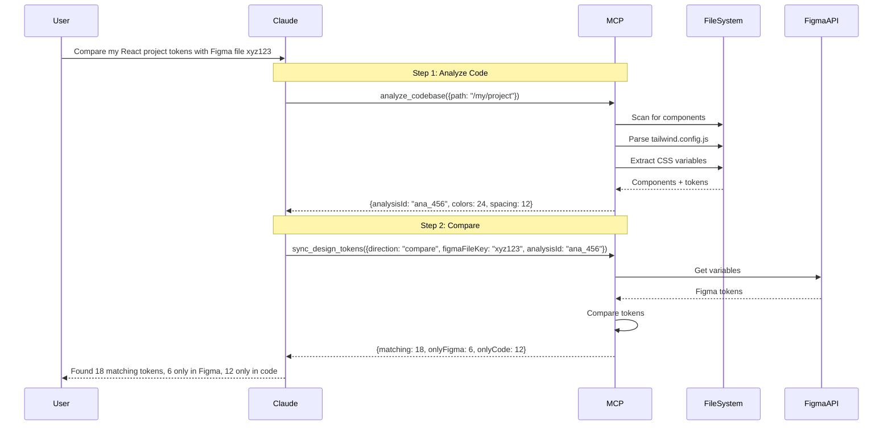

## Data Flow Diagrams

### Read Operation Data Flow

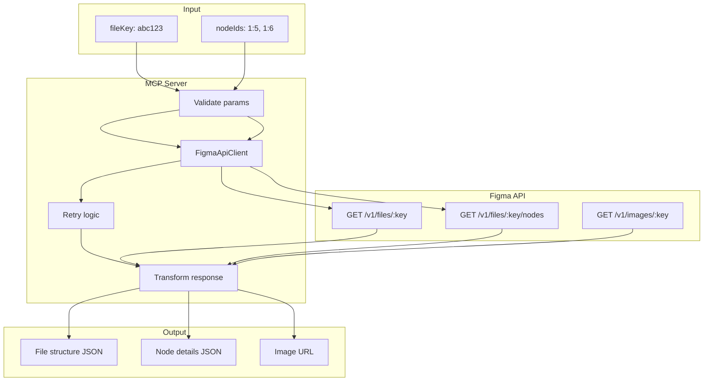

### Write Operation Data Flow

```mermaid
flowchart TB
    subgraph "Tool Input"
        I[create_frame params]
    end
    
    subgraph "MCP Server"
        V[Validate with Zod]
        B[PluginBridge]
        Q[Command Queue]
        W[Wait for response]
    end
    
    subgraph "WebSocket"
        WS[Send JSON command]
        WR[Receive JSON response]
    end
    
    subgraph "Figma Plugin"
        P[Parse command]
        E[Execute: figma.createFrame]
        R[Return nodeId]
    end
    
    subgraph "Output"
        O[{nodeId: "1:23"}]
    end
    
    I --> V --> B --> Q --> WS
    WS --> P --> E --> R --> WR
    WR --> W --> O
```

### Capture & Reconstruct Data Flow

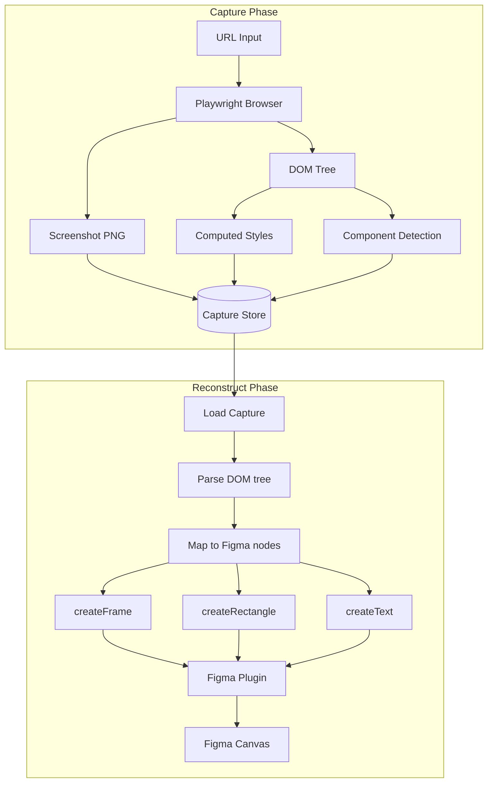

## Architecture Deep Dive

### Component Architecture

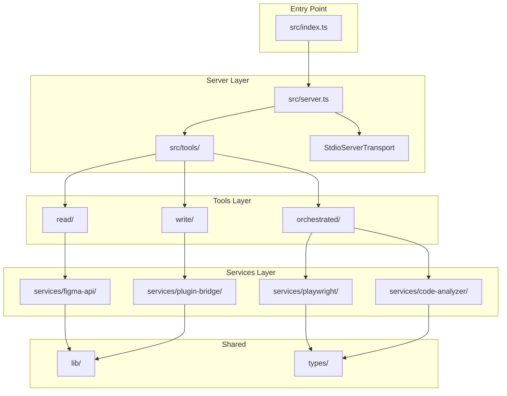

### Plugin Architecture

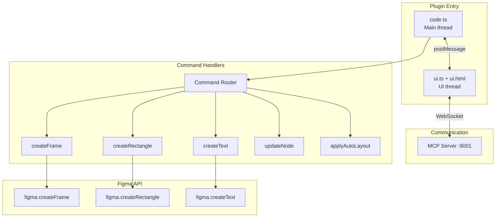

## Error Handling

```mermaid
flowchart TB
    subgraph "Error Types"
        FE[FigmaApiError<br/>REST API failures]
        PE[PluginBridgeError<br/>WebSocket issues]
        PN[PluginNotConnectedError<br/>Plugin not running]
        PT[PluginTimeoutError<br/>Command timeout]
        CE[CaptureError<br/>Playwright failures]
        VE[ValidationError<br/>Invalid params]
    end
    
    subgraph "Error Flow"
        Tool[Tool execution]
        Tool -->|try| Success[Return result]
        Tool -->|catch| Format[formatErrorForMcp]
        Format --> Response[{isError: true, text: message}]
    end
    
    subgraph "Retry Logic"
        FE -->|429, 503| Retry[Automatic retry]
        Retry -->|3 attempts| Final[Return error]
    end
```

## Quick Reference

### Environment Variables

| Variable | Required | Default | Description |
|----------|----------|---------|-------------|
| `FIGMA_ACCESS_TOKEN` | Yes | - | Personal access token from Figma |
| `PLUGIN_BRIDGE_PORT` | No | 9001 | WebSocket port for plugin |
| `DEBUG` | No | false | Enable debug logging |
| `CAPTURE_DIR` | No | ./captures | Directory for screenshots |

### File Structure

```
figmad-mcp/
├── src/
│   ├── index.ts              # Entry point
│   ├── server.ts             # MCP server setup
│   ├── tools/
│   │   ├── read/             # REST API tools
│   │   ├── write/            # Plugin bridge tools
│   │   └── orchestrated/     # Complex workflow tools
│   ├── services/
│   │   ├── figma-api/        # REST client
│   │   ├── plugin-bridge/    # WebSocket server
│   │   ├── playwright/       # Web capture
│   │   └── code-analyzer/    # Component parser
│   ├── lib/                  # Shared utilities
│   └── types/                # TypeScript types
├── plugin/
│   ├── manifest.json         # Figma plugin manifest
│   ├── code.ts               # Plugin main code
│   └── ui.ts + ui.html       # Plugin UI
└── dist/                     # Built output
```
